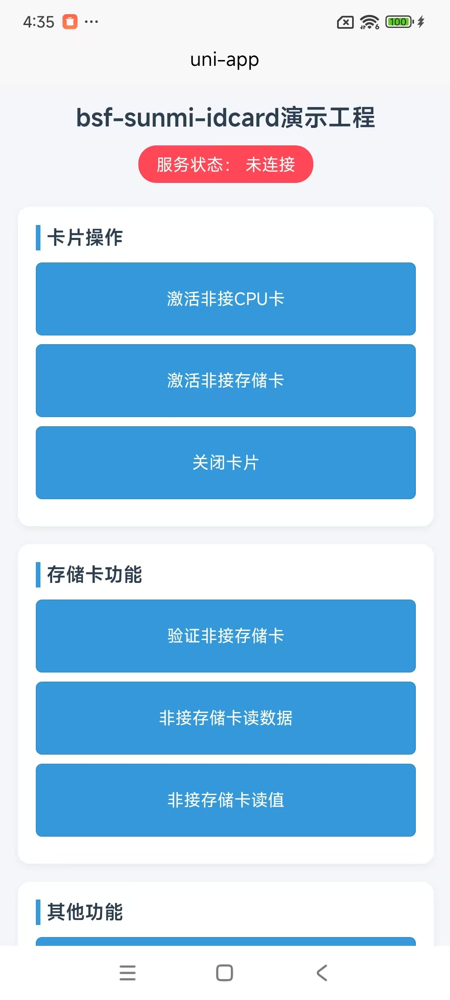

# 项目说明

此DEMO是商米K2身份证和非接服务的UTS插件[bsf-sunmi-idcard](https://byteee.fund/project/bsf-sunmi-idcard)的演示工程。

[文档地址](https://github.com/byteee-fund/bsf-sunmi-idcard-doc)

# 项目截图

# 版权声明

此软件归成都云字节网络技术有限公司所有，未经同意和授权，请勿非法传播和售卖。